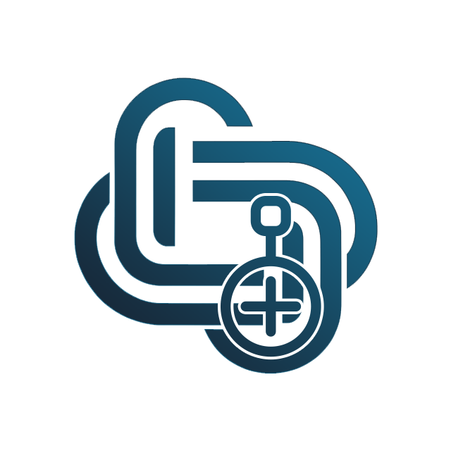

<p align="center"></p>

# coreBase


## Description
The `coreBase` package is a collection of classes that provide the basic functionality for the Laswitch Core Framework. The classes in this package are used by the other packages in the framework to provide the core functionality of the framework.

## License
This software is distributed under the [MIT](LICENSE) license.

## Requirements
* PHP >= 8.0

## Security
Please disclose any vulnerabilities found responsibly – report security issues to the maintainers privately. See [SECURITY.md](SECURITY.md) for more information.

## Installation
Using Composer:
```sh
composer require laswitchtech/core-base
```

## How do I use it?
Review the [Documentation](docs/).
